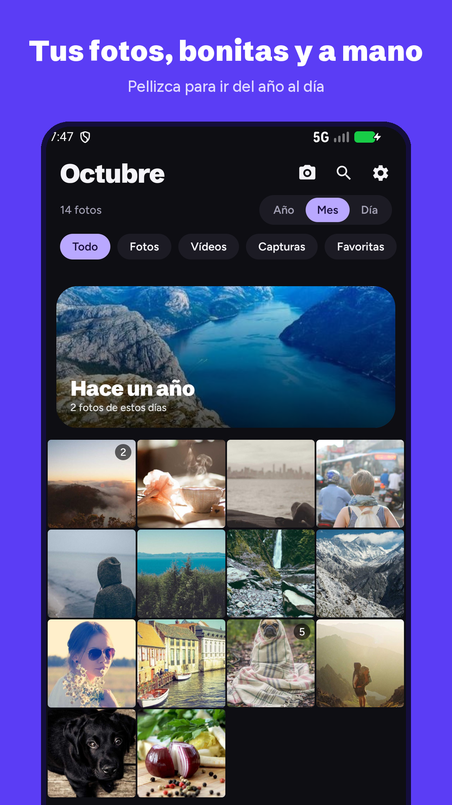
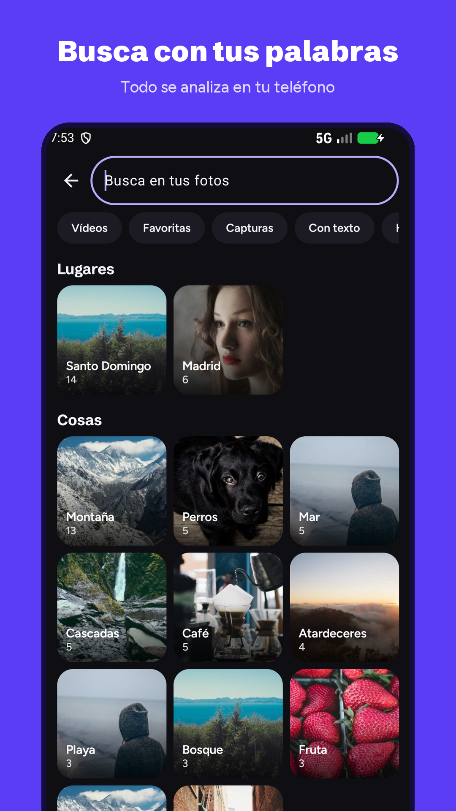
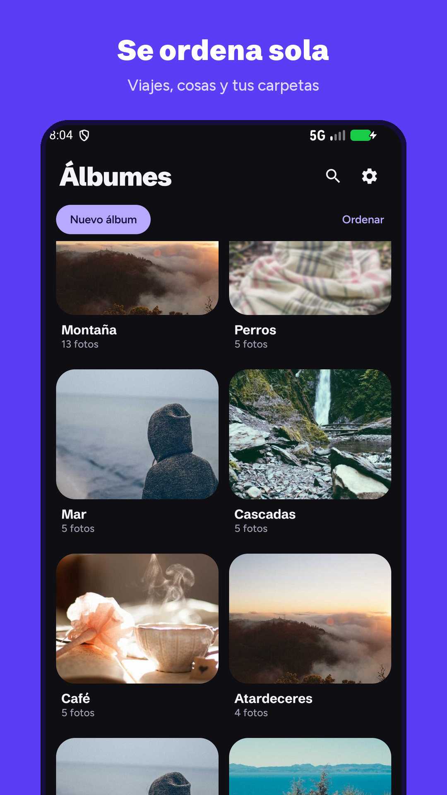
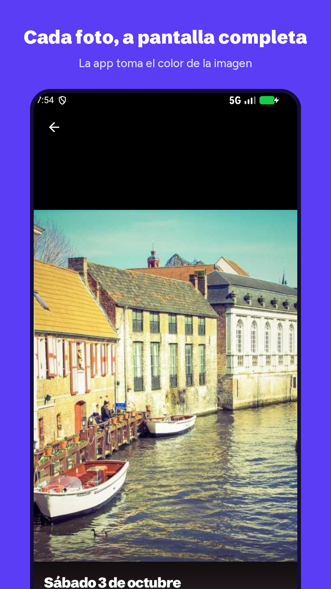
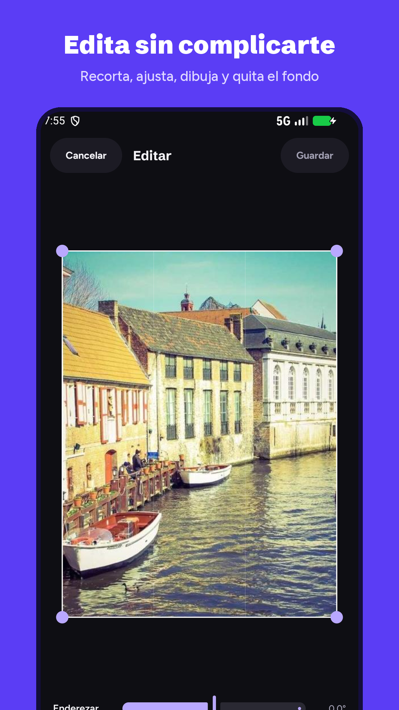

<p align="center">
  
</p>

<h1 align="center">Lumi Gallery</h1>

<p align="center">
  Una galería de fotos y vídeos para Android, rápida y privada.<br>
  Sin anuncios, sin cuenta y sin permiso de internet.
</p>

<p align="center">
  
  
  
  
  
</p>

## Qué hace

- **Busca con tus palabras.** "Perro en la playa", "cascada", "factura de marzo". Entiende lo que hay en la foto, lee el texto que aparece en ella y busca también por fecha, álbum y ciudad.
- **Se ordena sola.** Pellizca para ir del año al día, las fotos repetidas se apilan con la mejor encima, y hay álbumes automáticos de viajes y de temas.
- **Bloqueo de verdad.** La app entera o álbumes sueltos, con huella, cara, el bloqueo del teléfono o un PIN propio. Carpeta privada cifrada.
- **Edición.** Recortar, girar, enderezar, luz y color, filtros, dibujar y escribir encima, quitar el fondo y collage.
- **Reproductor de vídeo.** Doble toque para saltar, velocidad, ventana flotante, brillo y volumen deslizando, recorte sin pérdida y captura de fotogramas.
- **Liberar espacio.** Duplicados, repetidas, capturas antiguas y vídeos grandes, con revisión antes de borrar.

## Privacidad

Todo el análisis de las fotos se hace en el teléfono y la app no declara el permiso de internet, así que no puede enviar nada a ningún sitio.

- Política de privacidad: [PRIVACY.md](PRIVACY.md)
- La misma política como página web: <https://xsharklinx.github.io/lumi/privacidad.html> ([English](https://xsharklinx.github.io/lumi/privacy.html))

## Requisitos

- Android 11 o posterior.
- Para compilar: JDK 17 y el SDK de Android con la plataforma 36. No hace falta instalar Gradle: el proyecto trae su propio lanzador.

## Compilar

```bash
git clone https://github.com/XsharklinX/lumi.git
cd lumi
./gradlew :app:assemblePlayDebug        # en Windows: gradlew.bat
```

El APK queda en `app/build/outputs/apk/play/debug/`.

La versión de depuración va claramente más lenta que la optimizada. Para probar el rendimiento real:

```bash
./gradlew :app:assemblePlayRelease
```

Sin archivo de firma propio, la versión optimizada se firma con la clave de pruebas de Android, que sirve para instalarla a mano pero no para publicarla.

### Variantes

| Variante | Para qué | Diferencia |
|---|---|---|
| `play` | La que se publica en Google Play | No incluye las carpetas ocultas del sistema |
| `full` | Para instalar a mano | Añade "carpetas ocultas del sistema", que necesita el permiso de acceso a todos los archivos |

### Firma y publicación

Para firmar con una clave propia, crea `keystore.properties` en la raíz del proyecto:

```properties
storeFile=mi-clave.jks
storePassword=...
keyAlias=...
keyPassword=...
```

Ese archivo y los `.jks` están en `.gitignore` y no deben subirse nunca.

`python compilar.py` compila el AAB para Google Play y los dos APK y los deja en `Release/` con el número de versión en el nombre. Los pasos de publicación están en [playstore/LEEME.md](playstore/LEEME.md).

## Cómo está organizado

```
app/src/main/java/com/lumi/galeria/
├── MainActivity.kt        Permisos, navegación y acciones que necesitan al sistema
├── LumiViewModel.kt       Estado de la app y casi toda la lógica
├── data/
│   ├── Media.kt           Lectura de la biblioteca del teléfono
│   ├── Analysis.kt        Fotos repetidas
│   ├── Index.kt           Texto, lugar y nitidez de cada foto
│   ├── Semantic.kt        Búsqueda por significado
│   ├── Smart.kt           Buscador, álbumes automáticos, viajes y recuerdos
│   ├── Vault.kt           Carpeta privada cifrada
│   └── ...
└── ui/                    Una pantalla por archivo: Timeline, Viewer, Editor, Albums, Search...

app/src/main/assets/
├── clip/                  Modelo de búsqueda por significado y su licencia
└── places.bin             Ciudades del mundo, para poner nombre a los lugares

playstore/                 Icono, gráfico, capturas y textos de la ficha de Google Play
docs/                      Política de privacidad como página web (GitHub Pages)
```

La interfaz está hecha con Kotlin y Jetpack Compose. Los textos de la app están en español.

## Componentes de terceros

| Componente | Uso | Licencia |
|---|---|---|
| [MobileCLIP S0](https://github.com/apple/ml-mobileclip) (Apple) | Búsqueda por significado | La de Apple, incluida en [`assets/clip/LICENSE.txt`](app/src/main/assets/clip/LICENSE.txt) |
| [ONNX Runtime](https://onnxruntime.ai) | Ejecuta ese modelo en el teléfono | MIT |
| [ML Kit](https://developers.google.com/ml-kit) (Google) | Leer texto, reconocer cosas y quitar el fondo | Condiciones de ML Kit |
| [Natural Earth](https://www.naturalearthdata.com) | Lista de ciudades | Dominio público |
| [Coil](https://coil-kt.github.io/coil/) | Carga de imágenes | Apache 2.0 |
| [Media3](https://developer.android.com/media/media3) | Reproducción de vídeo | Apache 2.0 |
| Schibsted Grotesk y Figtree | Tipografías | SIL Open Font License |

## Contacto

contactosharklin@gmail.com
